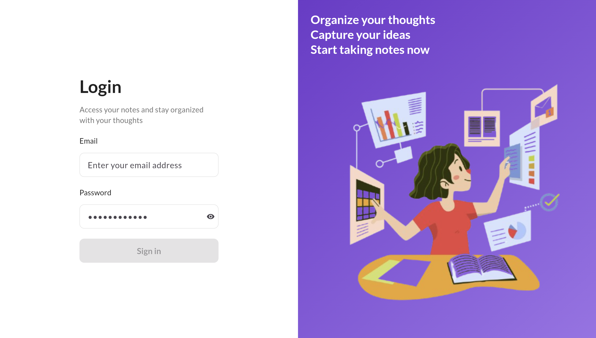
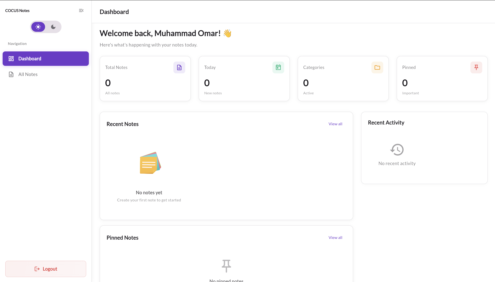
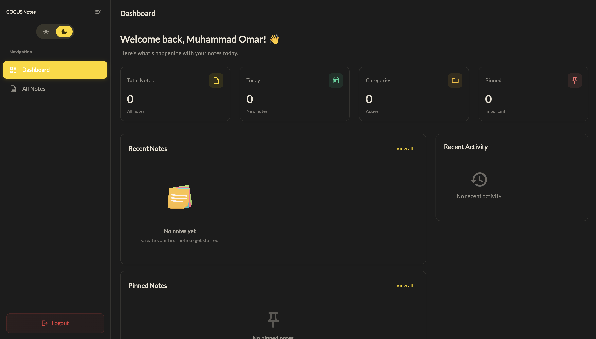
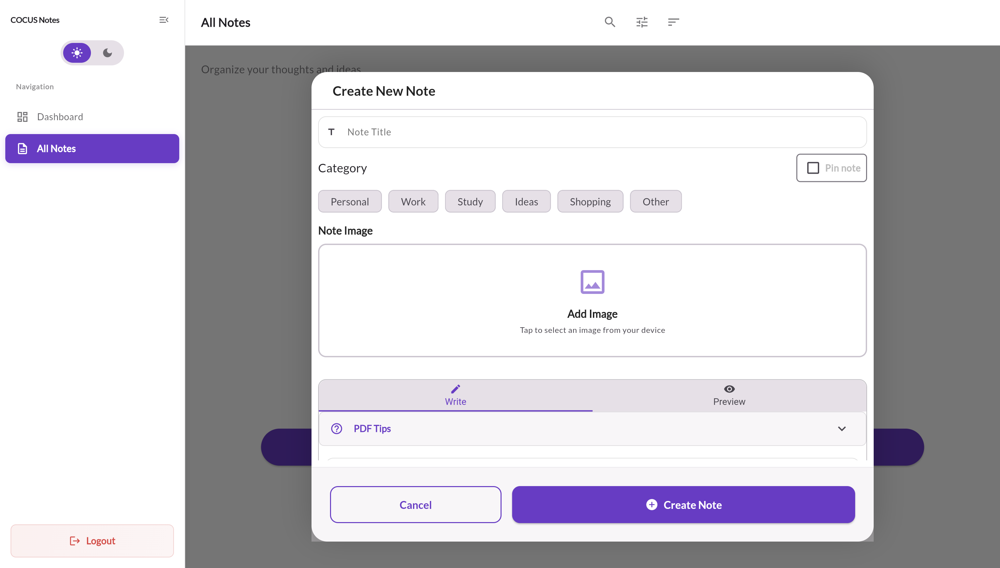
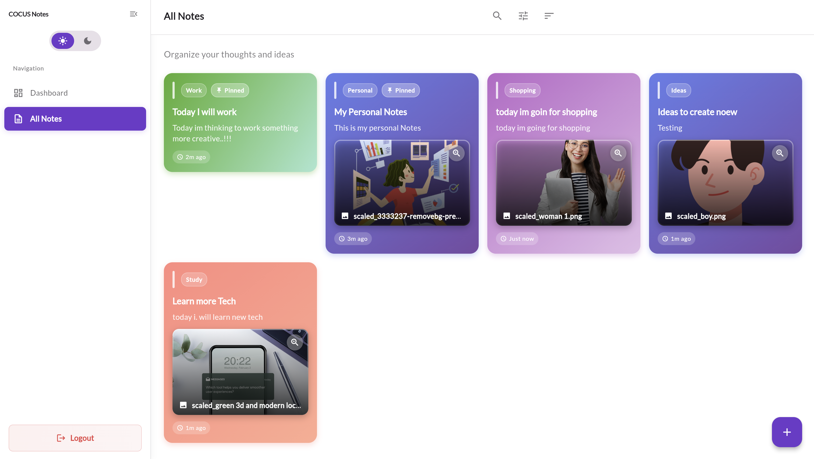
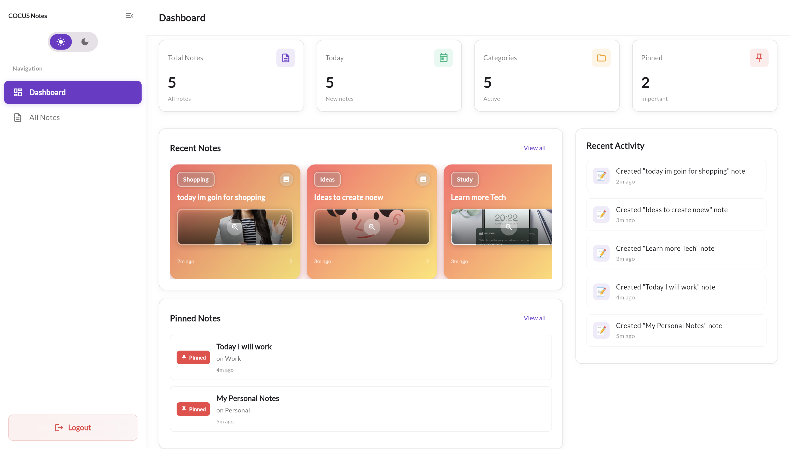

# NoteWebApp  Features & Technical Details

## Overview

This application was developed as part of the **technical challenge for COCUS**.  
It is a Flutter Web Notes Application that allows users to **create, view, update, and delete notes**, with **local data persistence** and a **modern UI**.  
I used **Clean Architecture**, **BLoC/Cubit** for state management, and **SharedPreferences** for local storage.  

In addition to the core features, I implemented:
- **Pin and Unpin Notes** for easy prioritization  
- **Light and Dark Mode** for better user experience and accessibility  
-  **Track note actions** in a recent activity log  
## Implemented Features
### Core
- Create, view, edit, and delete notes  
- Persistent local storage using **SharedPreferences**  
- Search and filter notes and sort the notes  
- Responsive layout for desktop and mobile web  
- Clean and minimal UI  

### Additional Implemented Features
- **Pin/Unpin Notes** for quick access  
- **Light and Dark Theme Mode** with saved preference  
- **Markdown Support** with live preview  
- **Insert Image in Notes**  
- **Export and Print Notes as PDF**  
- **Select Categories** to organize and link notes (e.g., Personal, Work, Ideas)  
- **Recent Activity Tracking** to record note actions like create, update, delete, pin, and unpin  

## Demo Access

To test the application:

Email: demo@example.com
Password: password123

## Screenshots

### login 

### Dashboard (Light Mode)

### Dashboard (Dark Mode)

### Note Editor (Markdown + Image)

### Notes List (with Categories and Pinned Notes)

## Testing & Code Quality

### Test Coverage: 75 Unit Tests
- **Domain Layer**: 23 tests (Use cases, entities, activity service)  
- **Data Layer**: 18 tests (Models, serialization, persistence)  
- **Presentation Layer**: 16 tests (State management, UI)  
- **Utilities**: 4 tests (Helper functions)  
- **Integration**: 14 tests (Widget tests and flows)  

### Quality Metrics
- **0 Errors** – Flutter Analyze clean  
- **0 Warnings** – No linter issues  
- **100% Type Safe** – Null safety enabled  
- **Clean Code** – SOLID principles applied  

## Run Locally

### Requirements
- Flutter SDK >= 3.0  
- Chrome 

### Steps
- git clone https://github.com/umarKhan1/NoteWebApp.git
- cd notewebapp
- flutter pub get
- flutter run -d chrome

## Note: Dont forget Credential 
Email: demo@example.com
Password: password123

## Security

- User-scoped data stored locally  
- Safe markdown rendering  
- Image size validation (max 5 MB)  
- Proper input validation and error handling 

## Final Words

Completing the COCUS technical challenge was more than a task — it was a chance to express my passion for creating meaningful digital experiences.  
Every feature I built reflects my belief that clean code, thoughtful design, and consistent effort lead to impactful results.  

This project reminded me why I love building with Flutter the freedom to turn ideas into elegant, working solutions.   I’m excited about the opportunity to bring this energy, creativity, and precision to **COCUS**, contributing to products that make a difference.  

With regards,  
**Muhammad Omar**
Flutter Developer  
[momarkhan.com](https://momarkhan.com)  
muhammadomar29@outlook.com  